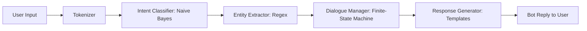

# 🤖 AI Chatbot from Scratch (No Frameworks)


> 🧠 A fully functional **AI Chatbot** built in pure Python — without using Rasa, Dialogflow, or any other NLP framework.  
> It’s handcrafted to teach the **core logic behind chatbots**, including tokenization, intent detection, entity extraction, dialogue flow, and response generation.

---

## 🧩 Table of Contents
- [Overview](#-overview)
- [Core Concepts](#-core-concepts)
- [Architecture](#-architecture)
- [Example Interaction](#-example-interaction)
- [Naive Bayes Intent Detection](#-naive-bayes-intent-detection)
- [Entity Extraction](#-entity-extraction)
- [Dialogue Manager](#-dialogue-manager)
- [Natural Language Generation (NLG)](#-natural-language-generation-nlg)
- [Folder Structure](#-folder-structure)
- [Setup & Run](#-setup--run)
- [Author](#-author)

---

## 💡 Overview

This chatbot is a **rule + probability-driven conversational AI** implemented entirely from scratch.  
It can:
- Recognize **intents** (e.g., greetings, weather queries, flight bookings)
- Extract **entities** like dates and cities
- Manage conversation **context**
- Generate human-like replies

Everything — from the tokenizer to the dialogue flow — is **manually coded**, giving you full control and understanding of each stage.

---

## ⚙️ Core Concepts

| Component | Description |
|------------|--------------|
| 🧹 **Tokenizer** | Cleans and splits text into words |
| 🧮 **Naive Bayes Classifier** | Predicts intent from bag-of-words probabilities |
| 🕵️‍♂️ **Entity Extraction** | Regex rules to detect cities, dates, and times |
| 🔄 **Dialogue Manager (FSM)** | Manages state and decides next steps |
| 💬 **Template-based NLG** | Converts logic into human-friendly responses |

---

## 🧭 Architecture



---

## 💬 Example Interaction

```
Bot: Hello! (type 'quit' to exit)
You: hi
Bot: Hi! How can I help you today?
You: book a flight
Bot: From which city are you flying?
You: from bengaluru
Bot: To which city would you like to go?
You: to paris
Bot: On which date would you like to travel (e.g., tomorrow)?
You: tomorrow
Bot: Done! I’ve (hypothetically) booked your flight from Bengaluru to Paris on tomorrow. ✈️
You: bye
Bot: Goodbye! Have a great day.
```

---

## 🧮 Naive Bayes Intent Detection

Each intent is trained on small example sentences:

```python
TRAIN = {
  "greet": ["hi", "hello", "good morning"],
  "book_flight": ["book a flight", "need to fly to delhi"],
  "check_weather": ["what's the weather", "will it rain today"]
}
```

Formula used:
\[
P(intent | text) ∝ P(intent) × Π P(word_i | intent)
\]

A **log-probability** version is implemented for numerical stability.
    A[User Input] --> B[Tokenizer]
    B --> C[Intent Classifier: Naive Bayes]
    C --> D[Entity Extractor: Regex]
    D --> E[Dialogue Manager: Finite-State Machine]
    E --> F[Response Generator: Templates]
    F --> G[Bot Reply to User]

---

## 🕵️‍♂️ Entity Extraction

Regex rules identify **cities** and **dates** in user messages.

```python
# Example
extract_entities("get me a flight from bengaluru to paris tomorrow")
```

Output:
```python
{'cities': ['bengaluru', 'paris'], 'dates': [('relative_day', 'tomorrow')]}
```

Supported patterns:
- Cities → `bengaluru, mumbai, delhi, paris, london, chennai`
- Dates → `today`, `tomorrow`, `monday`, `12/11`, `14:30`
- Routes → “from X to Y”

---

## 🧭 Dialogue Manager

Manages **conversation flow** using a **Finite-State Machine (FSM)**.

### Slots managed:
```python
slots = {
  "from_city": None,
  "to_city": None,
  "date": None
}
```

### Flow:
1. Detect `book_flight` intent  
2. Ask for missing slots  
3. Confirm when all are filled  
4. Reset on goodbye

Example:
```
User: book a flight
→ Bot: From which city are you flying?
```

---

## 💬 Natural Language Generation (NLG)

Uses **simple, readable templates** for each action:

```python
if action == "ask_from_city":
    return "From which city are you flying?"

if action == "action_book_flight":
    return f"Done! Flight from {fc} to {tc} on {dt} booked (hypothetically). ✈️"
```

---

## 📁 Folder Structure

```
📦 chatbot-from-scratch
 ┣ 📜 chatbot.py         # Main Python script
 ┣ 📜 README.md          # Documentation
 ┗ 📄 requirements.txt   # (optional)
```

---

## 🧰 Setup & Run

### 1️⃣ Clone the repo
```bash
git clone https://github.com/yourusername/chatbot-from-scratch.git
cd chatbot-from-scratch
```

### 2️⃣ Run the chatbot
```bash
python chatbot.py
```

### 3️⃣ Talk to it!
```
Bot: Hello! (type 'quit' to exit)
You: what's the weather in mumbai tomorrow?
Bot: The weather in Mumbai tomorrow looks pleasant with mild temperatures.
```

---

## 👨‍💻 Author

**K. Vilohit**  
*Full-Stack Developer | AI & ML Engineer*  
📍 Bengaluru, India  


---

⭐ **If you found this project helpful, don’t forget to give it a star!**

🧪 Functions Summary
Function	Purpose
tokenize(text)	Lowercase, clean punctuation, split text
NaiveBayesIntents.fit()	Train on example sentences
NaiveBayesIntents.predict()	Detect intent
extract_entities(text)	Find cities/dates
DialogueManager.next_action()	Determine next step
nlg(action, params)	Generate final reply

🧩 Supported Intents
Intent	Example	Behavior
greet	“hello”	Bot greets back
smalltalk	“how are you?”	Small talk
check_weather	“weather in delhi?”	Responds with mock weather
book_flight	“book flight to paris”	Begins booking flow
goodbye	“bye”	Ends chat

🚀 Future Enhancements
✅ Short term

Add more cities & date patterns

Randomize response templates

💡 Next level

Replace bag-of-words with TF-IDF or word embeddings

Add context memory (multi-turn awareness)

Integrate live APIs (Weather, Flight search)

Create a web or Telegram interface

👨‍💻 Author
K. Vilohit
Full-Stack Developer | AI & ML Engineer
📍 Bengaluru, India
